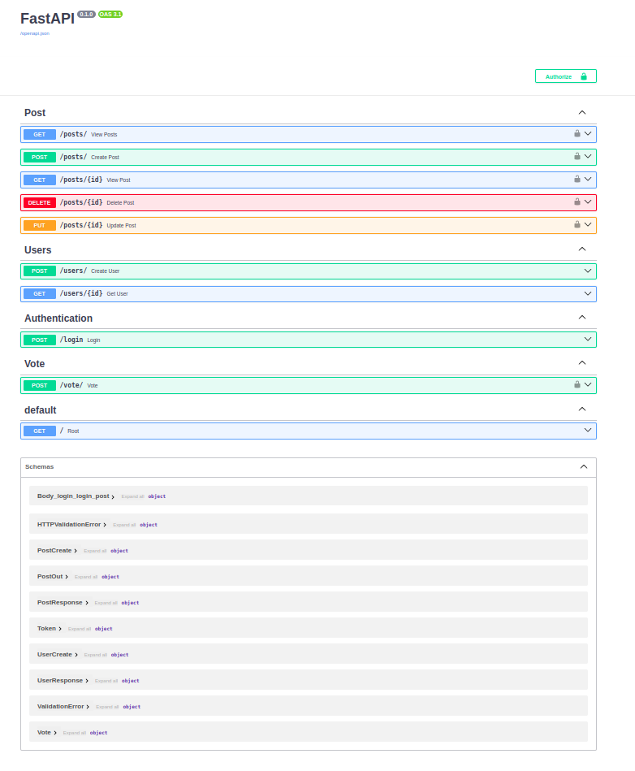

# FastAPI App

This is a **FastAPI** app that shows how to build web applications quickly and easily. It includes examples like handling routes, using dependencies, and checking data.

## Why FastAPI


- **Speed**: FastAPI is one of the fastest Python web frameworks, making it ideal for building APIs.
- **Easy to Use**: It's simple and beginner-friendly with clean code structure.
- **Auto Documentation**: It automatically generates interactive API docs (Swagger and ReDoc).
- **Validation**: FastAPI checks data types and ensures the input is valid without much effort.
- **Asynchronous Support**: It supports async code for handling multiple requests at once efficiently.
- **Built-in Features**: Includes user-friendly features like dependency injection and security mechanisms.

## Technologies Used
- **FastAPI**: The main framework for building APIs quickly and efficiently.
- **Python**: The programming language used to write FastAPI apps.
- **Uvicorn**: A lightning-fast ASGI server used to run FastAPI applications.
- **Pydantic**: A data validation library for Python used in FastAPI for validating request data.
- **SQLAlchemy**: For database interactions if you're working with relational databases.
- **PostgreSQL**: Working with database
- **Swagger UI / ReDoc**: For auto-generated API documentation
**Alembic**: A database migration tool often used with SQLAlchemy


## Installation

1. Clone the repository:

    ```bash
    git clone https://github.com/a-anuj/fastapi-app.git
    cd fastapi-app
    ```

2. Set up a virtual environment:

    ```bash
    python -m venv venv
    source venv/bin/activate  
    # On Windows: venv\Scripts\activate
    ```

3. Install the required dependencies:

    ```bash
    pip install -r requirments.txt
    ```

## Running the App

To run the FastAPI app, use the following command:

```bash
uvicorn app.main:app --reload
```

## Testing with pytest

**pytest** is a powerful testing tool for Python, offering simple syntax, reusable fixtures, and easy test writing for both small and complex apps.

### Commands
- Install pytest

    ```bash 
    pip install pytest
    ```
- Run the tests
    ```bash
    pytest appname.py
    ```

## Documention
FastAPI automatically generates interactive API documentation that you can access at the following URLs:

- Swagger UI: http://127.0.0.1:8000/docs
- ReDoc: http://127.0.0.1:8000/redoc <br>

You can use these interfaces to explore the API endpoints, see request and response formats, and test them directly from your browser. 

### Example Documentation
